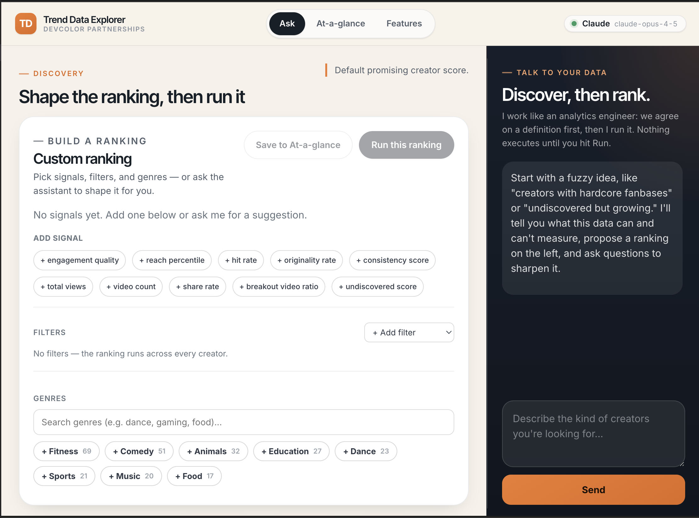
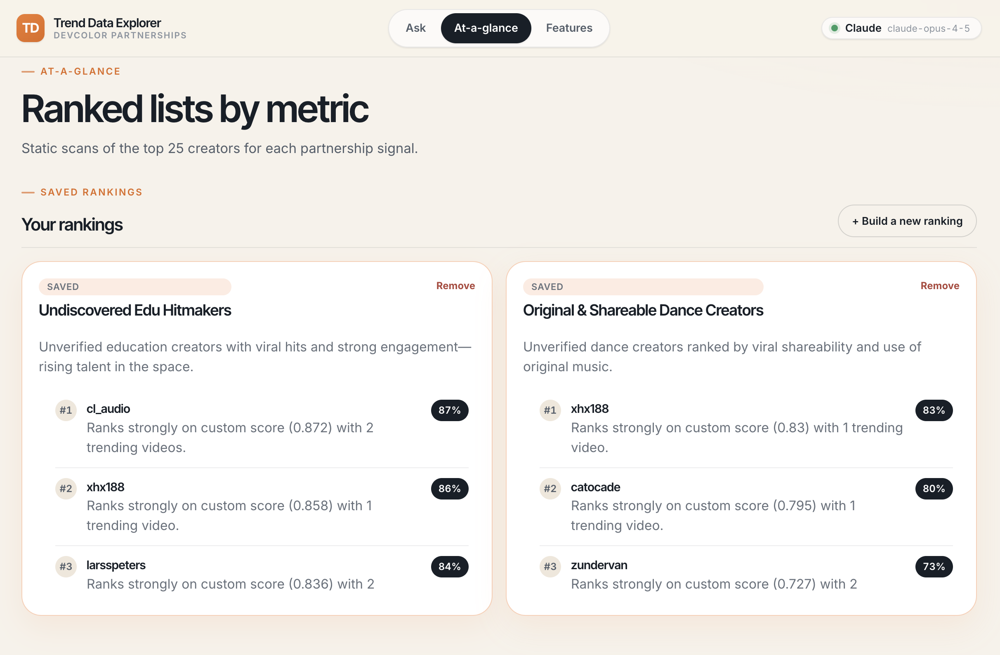
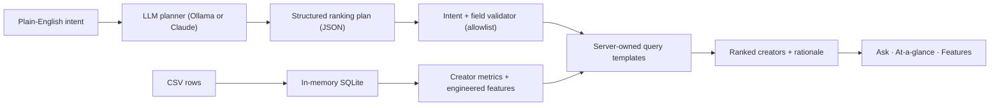

# Trend Data Explorer

**An AI-enabled feature-engineering and data-exploration platform.** Describe what
you're looking for in plain English and the platform helps you turn a fuzzy idea into a
concrete, defensible *definition* over your data — a weighted recipe of named features,
filters, and facets — then ranks the results and lets you save the recipe for reuse. An
LLM acts as your analytics engineer throughout, and it **never writes SQL**.



## The idea

Most "talk to your data" tools jump straight from a vague prompt to a chart. Real
discovery is messier. You start with something fuzzy — *"undiscovered but growing,"
"creators with hardcore fanbases," "big accounts whose audience isn't resharing"* — and
what you actually need is help translating that instinct into a measurable definition you
can trust and defend.

Trend Data Explorer treats that translation as the product. The assistant behaves like an
analytics engineer sitting next to you:

- it maps your intent onto the **features it can actually measure**, grounded in each
  feature's definition;
- it tells you what the data **can and can't** support before committing to a number;
- it proposes a ranking as an **explicit, editable recipe** — weighted signals, filters,
  and genres — rather than a black-box answer;
- it asks one sharp, sharpening question at a time instead of guessing.

Nothing executes until you press **Run**, and every score traces back to a named feature
with a plain-English meaning, source fields, and caveats.

## What you can do

- **Explore conversationally.** Bring a vague direction; the assistant interprets it,
  explains the mapping to concrete metrics, and suggests signals to add or questions to
  consider. Suggestions drop straight into the ranking with one click.
- **Engineer features, not just filters.** Build a ranking from an allowlisted catalog of
  engineered features (normalized engagement, reach percentile, hit rate, breakout ratio,
  originality, consistency, and more). When nothing in the catalog fits your intent, the
  platform surfaces that gap and proposes a new feature to define.
- **Keep scoring transparent.** Signals are combined as normalized percentiles with
  visible weights that never exceed 100%, and each signal can be inverted (lower ranks up)
  for questions like "who is *not* being reshared."
- **Slice by genre.** Genres are derived quickly from captions and hashtags (no
  embeddings), so you can scope any ranking to niches like fitness, comedy, or dance.
- **Save reusable recipes.** Promote any ranking to the At-a-glance page, where saved
  definitions are re-computed against live data.



## This deployment: TikTok creator partnerships

The platform is dataset-agnostic; this instance is configured for the TikTok creator
partnerships assignment. It loads `2026datathon_interview_data.csv` into an in-memory
SQLite database, derives creator-level features, and exposes three surfaces:

- **Ask** — the conversational discovery loop and ranking builder (first screenshot).
- **At-a-glance** — ranked lists per built-in signal plus your saved recipes (second
  screenshot).
- **Features** — the catalog of every engineered feature with plain-English meaning,
  source fields, calculation, scale, best use, and caveats.

## Run it

Install dependencies:

```bash
npm install
```

Start the app (React on `http://localhost:5173`, API on `http://localhost:5174`):

```bash
npm run dev
```

By default the discovery loop runs on a local Ollama model. Pull one first:

```bash
ollama pull llama3.2:3b
# or point at another local model
OLLAMA_MODEL=qwen2.5:14b-instruct npm run dev
```

## Choosing the model provider

The discovery loop is provider-agnostic. Selection order: `LLM_PROVIDER` if set, otherwise
Anthropic when `ANTHROPIC_API_KEY` is present, otherwise local Ollama. Copy
`.env.example` to `.env` and fill in what you need.

Use a commercial model (recommended for multi-turn discovery quality):

```bash
# .env
LLM_PROVIDER=anthropic
ANTHROPIC_API_KEY=sk-ant-...
ANTHROPIC_MODEL=claude-opus-4-5   # or claude-opus-4-8, claude-opus-5, etc.
```

Stay fully local (no key, private):

```bash
# .env
LLM_PROVIDER=ollama
OLLAMA_MODEL=qwen2.5:14b-instruct
```

Whichever provider is active, the model only proposes validated JSON plans — the security
posture does not change when you swap providers.

## Feature engineering loop

Discovery and feature engineering are the same loop. As you describe intent, the assistant
builds up a ranking from an allowlisted catalog of engineered features, and proposes new
ones when the catalog falls short. The server scores creators by combining the chosen
features as **normalized percentiles** before applying weights, so signals on different
scales (a 0–1 rate vs. millions of views) stay comparable.

Engineered features include:

- normalized engagement quality (likes + weighted comments + weighted shares)
- reach percentile and total views
- hit rate above dataset percentile thresholds
- breakout video ratio (top video vs. the creator's own average)
- original-music rate and hashtag diversity
- caption hashtag, mention, and word counts
- average video duration, posting span, and posting consistency
- rule-based genres derived from captions and hashtags

### What "promising" means

The default `promising_score` is a transparent, inspectable recipe:

```text
0.35 * engagement_quality
+ 0.25 * reach_percentile
+ 0.20 * hit_rate
+ 0.10 * originality_rate
+ 0.10 * consistency_score
```

It favors creators who are not merely big, but who show strong normalized engagement,
enough reach, repeat hits, original audio usage, and some consistency across the observed
batch. Other built-in strategy concepts:

- `engaging` — likes + 3× comments + 5× shares
- `viral` — total shares, share rate, and breakout behavior
- `prolific` — number of trending videos in the CSV
- `undiscovered` — unverified creators with high engagement quality and meaningful reach
- `breakout` — creators whose top video strongly outperforms their own average

## How it works



## Accuracy and security

The model never writes SQL. The LLM only proposes structured JSON — an intent, filters,
signals with signed weights, genres, sort field, and limit. The server validates every
field against an allowlist and executes only server-owned query templates through
`queryRunner`. Because model output is confined to a validated plan, prompt-injection
cannot reach the database, and swapping providers does not change the security posture.

If the model is unavailable or returns invalid JSON, the app falls back to deterministic
keyword mapping. Results always show the interpreted definition and remind the reader that
this dataset has no follower counts or audience demographics — so "reach" means views from
this trending-video batch, not overall audience size.
