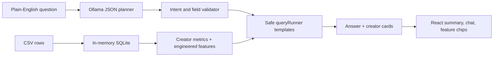

# DevColor Creator Dashboard

A lightweight talk-to-your-data prototype for the TikTok creator partnerships assignment. It loads the CSV into an in-memory SQLite database, derives creator-level features, and lets an LLM (local Ollama or a commercial model like Claude) translate plain-English questions into safe query plans.

## Run It

Install dependencies:

```bash
npm install
```

Pull the default local model:

```bash
ollama pull llama3.2:3b
```

Start the app:

```bash
npm run dev
```

The React app runs at `http://localhost:5173` and the API runs at `http://localhost:5174`.

You can use another local model with:

```bash
OLLAMA_MODEL=qwen2.5:3b npm run dev
```

## Choosing the model provider

The discovery loop is provider-agnostic. Selection order: `LLM_PROVIDER` if set, otherwise Anthropic when `ANTHROPIC_API_KEY` is present, otherwise local Ollama. Copy `.env.example` to `.env` and fill in what you need.

Use a commercial model (recommended for the multi-turn discovery quality):

```bash
# .env
LLM_PROVIDER=anthropic
ANTHROPIC_API_KEY=sk-ant-...
ANTHROPIC_MODEL=claude-opus-4-5   # or claude-opus-4-8, claude-opus-5, etc.
```

Stay fully local (no key, private):

```bash
# .env
LLM_PROVIDER=ollama
OLLAMA_MODEL=qwen2.5:14b-instruct
```

Whichever provider is active, the model still only proposes validated JSON plans — it never writes SQL.

## What "Promising" Means

The default `promising_score` is a transparent feature recipe:

```text
0.35 * engagement_quality
+ 0.25 * reach_percentile
+ 0.20 * hit_rate
+ 0.10 * originality_rate
+ 0.10 * consistency_score
```

That definition favors creators who are not just big, but have strong normalized engagement, enough reach, repeat hits, original audio usage, and some consistency in the observed batch.

Other built-in strategy concepts:

- `engaging`: likes + 3x comments + 5x shares
- `viral`: total shares, share rate, and breakout behavior
- `prolific`: number of trending videos in the CSV
- `undiscovered`: unverified creators with high engagement quality and meaningful reach
- `breakout`: creators whose top video strongly outperforms their own average

## Data Flow



## Feature Engineering Loop

The UI includes metric chips and weights so a user can manually define what matters for a partnership brief. The server accepts those selected metrics as a custom feature recipe and scores creators from allowlisted numeric fields.

Useful engineered features include:

- caption hashtag, mention, and word counts
- original music rate
- hashtag diversity
- average video duration
- posting span and posting consistency
- hit rate above dataset percentile thresholds
- breakout video ratio
- normalized engagement quality

## Accuracy and Security

The model never writes SQL. The LLM (Ollama or Claude) only proposes structured JSON with an intent, filters, sort field, limit, and optional feature recipe. The server validates every field against an allowlist and executes only server-owned query templates through `queryRunner`. Because the model output is confined to a validated plan, swapping providers does not change the security posture.

If the model is unavailable or returns invalid JSON, the app falls back to deterministic keyword mapping. Answers also show the interpreted metric definition and remind the reader that the CSV has no follower counts or audience demographics, so reach means views from this trending-video batch.
